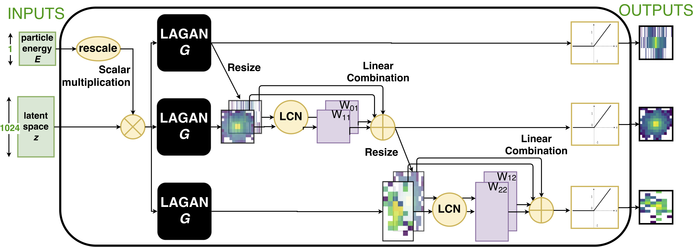
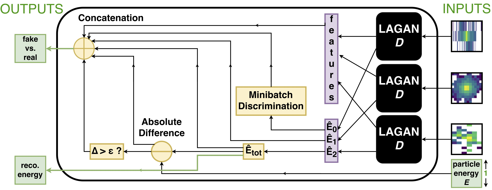

# CaloGAN
Simulating 3D High Energy Particle Showers in Multi-Layer Electromagnetic Calorimeters with Generative Adversarial Networks.

| Asset  | Location |
| ------------- | ------------- |
| Training Data (GEANT showers) | [](https://doi.org/10.17632/pvn3xc3wy5.1)|
| Source Code (this repo!) | [](https://zenodo.org/badge/latestdoi/82329392)|

This repository contains what you'll need to reproduce M. Paganini ([@mickypaganini](https://github.com/mickypaganini)), L. de Oliveira ([@lukedeo](https://github.com/lukedeo)), B. Nachman ([@bnachman](https://github.com/bnachman)), _CaloGAN: Simulating 3D High Energy Particle Showers in Multi-Layer Electromagnetic Calorimeters with Generative Adversarial Networks_ [[`arXiv:1705.02355`](https://arxiv.org/abs/1705.02355)].

## Goal
The goal of this project is to help physicists at CERN speed up their simulations by encoding the most computationally expensive portion of the simulation process (i.e., showering in the EM calorimeter) in a deep generative model.

The challenges come from the fact that this portion of the detector is longitudinally segmented into three layers with heterogeneous granularity. For simplicity, we can visualize the energy depositions of particles passing through the detector as a series of three images per shower, while keeping in mind the sequential nature of their relationship in the generator. 

To download and better understand the training dataset, visit the [Mendeley Data repository](https://data.mendeley.com/datasets/pvn3xc3wy5/1).


## Getting Started

This repository contains three main folders: `generation`, `models` and `analysis`, which represent the three main stages in this project. You may decide to only engage in a subset of them, so we decided to provide you with all you need to jump right in at the level you are interested in. 

`generation` contains the code to build the electromagnetic calorimeter geometry and shoot particles at it with a give energy. This is all based on `Geant4`. For more instructions, go to [Generation on PDSF](#generation-on-pdsf).

`models` contains the core ML code for this project. The file [`train.py`](https://github.com/hep-lbdl/CaloGAN/blob/master/models/train.py) takes care of loading the data and training the GAN. 

`analysis` contains Jupyter Notebooks used to evaluate performance and produce all plots for the paper.

## Generation on PDSF

On [PDSF](http://www.nersc.gov/users/computational-systems/pdsf/), your should run all generation code that outputs big files to a scratch space. To make a scratch environment, run `mkdir /global/projecta/projectdirs/atlas/{your-username}`, and for convenience, link to home via `ln -s /global/projecta/projectdirs/atlas/{your-username} ~/scratch`.

To build the generation code on PDSF, simply run `source cfg/pdsf-env.sh` from the `generation/` folder in the repository. This loads modules.

Next, you can type `make` which should build an executable called `generate`. Because of how Geant4 works, this executable gets deposited in `$HOME/geant4_workdir/bin/Linux-g++/`, which is in your `$PATH` when the modules from `cfg/pdsf-env.sh` are loaded.	

To run the generation script, run `generate -m cfg/run2.mac`. You can change generation parameters inside [`cfg/run2.mac`](https://github.com/hep-lbdl/CaloGAN/blob/master/generation/cfg/run2.mac) (follow [these instructions](https://geant4.web.cern.ch/geant4/UserDocumentation/UsersGuides/ForApplicationDeveloper/html/ch02s07.html)). 

This will output a file called `plz_work_kthxbai.root` with a TTree named `fancy_tree`, which will contain a branch for each calorimeter cell (`cell_#`) with histograms of the energy deposited in that cell across the various shower events. The last three cells (numbered 504, 505, and 506) actually represent the overflow for each calorimeter layer. Finally, a branch called `TotalEnergy` is added for bookkeeping. 

We provide you with a convenient script to **convert the ROOT file into a more manageable HDF5 archive**. The `convert.py` script is located in the `generation/` folder and can be used as follows:
```
usage: convert.py [-h] --in-file IN_FILE --out-file OUT_FILE --tree TREE

Convert GEANT4 output files into ML-able HDF5 files

optional arguments:
  -h, --help            show this help message and exit
  --in-file IN_FILE, -i IN_FILE
                        input ROOT file
  --out-file OUT_FILE, -o OUT_FILE
                        output HDF5 file
  --tree TREE, -t TREE  input tree for the ROOT file

```
So you can run, for example, `python convert.py --in-file plz_work_kthxbai.root --out-file test.h5 --tree fancy_tree`.
Assuming you specified `/run/beamOn 1000` in your `run.mac` file, the structure of the output HDF5 should look like this:
```
energy                   Dataset {1000, 1}
layer_0                  Dataset {1000, 3, 96}
layer_1                  Dataset {1000, 12, 12}
layer_2                  Dataset {1000, 12, 6}
overflow                 Dataset {1000, 3}
```
To launch a batch job on PDSF, simply run `./launch <num_jobs>`, to launch `<num_jobs>` concurrent tasks in a job array.

## The CaloGAN Model
This work builds on the solution presented in [`arXiv/1701.05927`](https://arxiv.org/abs/1701.05927) which we named LAGAN, or Location-Aware Generative Adversarial Network. This is a Physics specific modification of the more common DCGAN and ACGAN frameworks which is specifically designed to handle the levels of sparsity, the location dependence, and the high dynamic range that characterizes Physics images.

### Generator

The Generator contains three parallel LAGAN-style streams with an in-painting mechanism to handle the sequential nature of these shower images.
### Discriminator

The discriminator uses convolutional features combined with ad-hoc notions of sparsity and reconstructed energy to classify real and fake images as well as comparing the reconstructred energy with the condition requested by the user.

## Training the CaloGAN model
To begin the training process, create a YAML file with the specification in [`models/particles.yaml`](https://github.com/hep-lbdl/CaloGAN/blob/master/models/particles.yaml) for all the particles you want to train on. **In the paper, we only train one GAN per particle type.** If you specify more than one particle type and dataset in the YAML file, it will train an ACGAN, which we found to not be as performant. Assuming that you have a folder called `data/` in the root directory of the project, and you have a file inside called `eplus.h5` (downloaded from Mendeley, perhaps?), you can train your own CaloGAN by running 

```bash
python -m models.train models/particles.yaml
```

We recommend running `python -m models.train -h` at least once to see all the parameters one can change. 
